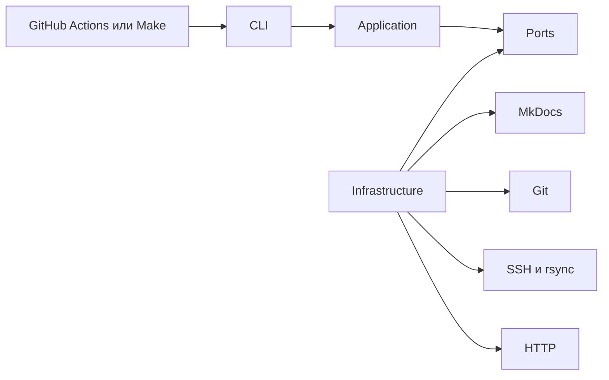

# Архитектура решения

Решение использует Transaction Script для небольшого числа операций публикации.
Это соответствует масштабу проекта и сохраняет явные границы между orchestration
и внешними инструментами.

## Прикладные операции

- `build` — построить проверенный артефакт и записать метаданные;
- `deploy` — загрузить и активировать production-релиз;
- `preview` — опубликовать сборку ветки;
- `healthcheck` — проверить код ответа и метку релиза;
- `rollback` — вернуть предыдущий production-релиз.

## Почему отсутствует Domain Model

У проекта нет сложных бизнес-сущностей, базы данных и продолжительных бизнес-
транзакций. Правила ограничены безопасными именами, путями и порядком шагов
публикации, поэтому они выражены типизированными моделями и сценариями.
