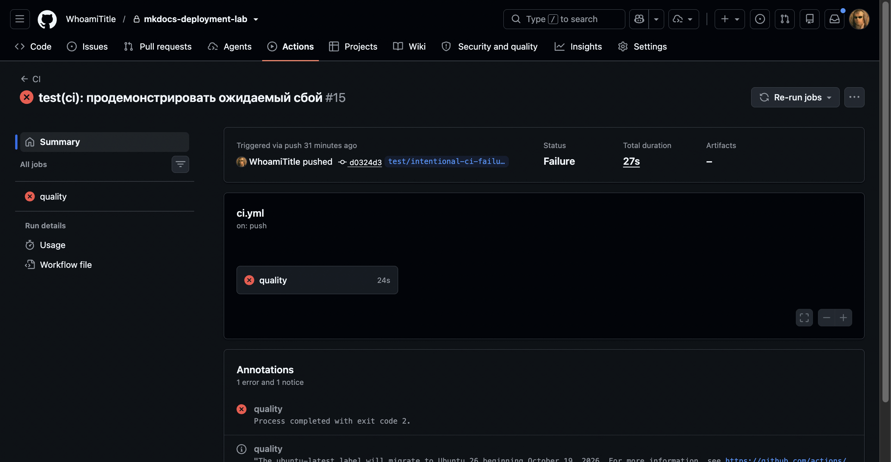

# Отладка

В этот раздел заносятся только фактически возникшие ошибки. Для каждой ошибки
сохраняется очищенный от секретов фрагмент журнала.

## Шаблон записи

### Ошибка N. Краткое название

**Текст ошибки:**

```text
Фрагмент фактического сообщения
```

**Гипотеза:** предполагаемая причина.

**Проверка:** команда или эксперимент, которыми проверена гипотеза.

**Причина:** установленная причина.

**Решение:** внесённое изменение.

**Результат:** повторная проверка после исправления.

## Ошибка 1. Проверка Ruff остановила pipeline

**Текст ошибки:**

```text
UP017 Use datetime.UTC alias
RUF100 Unused noqa directive
E501 Line too long
Found 7 errors.
make: *** [lint] Error 1
```

**Гипотеза:** исходный код не соответствует выбранному набору правил Ruff для
Python 3.13.

**Проверка:** выполнена команда `.venv/bin/python -m ruff check src tests`,
которая указала точные файлы и строки.

**Причина:** использовался прежний вариант `timezone.utc`, оставалась ненужная
директива `noqa`, а несколько сообщений об ошибках превышали ограничение в 100
символов.

**Решение:** применён `datetime.UTC`, удалена лишняя директива, длинные выражения
разбиты на несколько строк.

**Результат:** повторный `ruff check` завершился сообщением `All checks passed!`.

## Ошибка 2. Проверка форматирования обнаружила 18 файлов

**Текст ошибки:**

```text
18 files would be reformatted, 3 files already formatted
make: *** [lint] Error 1
```

**Гипотеза:** созданные файлы синтаксически корректны, но ещё не приведены к
единому формату Ruff.

**Проверка:** выполнена команда `.venv/bin/python -m ruff format --check src tests`.

**Причина:** первоначальный каркас создавался до первого запуска автоматического
форматтера.

**Решение:** выполнена команда `.venv/bin/python -m ruff format src tests`.

**Результат:** повторная проверка сообщила `21 files already formatted`.

## Ошибка 3. Неверная точка входа codespell

**Текст ошибки:**

```text
.venv/bin/python: No module named codespell
make: *** [lint] Error 1
```

**Гипотеза:** имя установленного пакета и имя Python-модуля для запуска не
совпадают.

**Проверка:** команды `.venv/bin/codespell --version` и
`.venv/bin/python -m codespell_lib --version` вернули одну версию `2.4.3`.

**Причина:** в Makefile использовалась несуществующая точка входа
`python -m codespell`.

**Решение:** команда заменена на переносимый вызов
`python -m codespell_lib`.

**Результат:** codespell успешно прошёл в составе полного `make check`.

## Ошибка 4. Смешение типов инфраструктурных адаптеров

**Текст ошибки:**

```text
Incompatible types in assignment
expression has type "SshRsyncReleaseGateway"
variable has type "LocalReleaseGateway"
```

**Гипотеза:** mypy вывел тип локальной переменной по её первому присваиванию и
не разрешил использовать то же имя для SSH-адаптера.

**Проверка:** сообщение указывало на второе присваивание `gateway` в функции
диспетчеризации CLI.

**Причина:** локальный и удалённый адаптеры имели одно имя переменной в общей
области видимости.

**Решение:** введены отдельные имена `local_gateway` и `ssh_gateway`.

**Результат:** mypy проверил 23 исходных файла без ошибок.

## Ошибка 5. `configure-pages` не получил доступ к Pages API

**Текст ошибки:**

```text
Get Pages site failed.
Resource not accessible by integration
```

**Гипотеза:** Pages не включён либо токен job не имеет разрешения читать
конфигурацию Pages.

**Проверка:** в настройках репозитория источником публикации был выбран GitHub
Actions. Проверка `.github/workflows/publish.yml` показала, что job
`build-pages` наследовал только `contents: read`. Для приватного репозитория
запрос `GET /repos/{owner}/{repo}/pages` также требует `pages: read`.

**Причина:** `actions/configure-pages` обращался к Pages API через
`GITHUB_TOKEN`, которому в job `build-pages` не было выдано разрешение
`pages: read`.

**Решение:** для `build-pages` явно добавлены минимальные разрешения
`contents: read` и `pages: read`. Параметр `enablement` не применялся, потому
что он требует токен, отличный от стандартного `GITHUB_TOKEN`.

**Результат:** повторный workflow опубликовал коммит `0c3ae30` по адресу
<https://whoamititle.github.io/mkdocs-deployment-lab/>. Удалённая проверка
подтвердила 17 страниц, отсутствие битых навигационных ссылок и внешних
runtime-ресурсов, доступность поискового индекса и локальных ресурсов KaTeX.

## Ошибка 6. Намеренная проверка остановки CI

**Текст ошибки:**

<pre><code>
python -m codespell_lib README.md config docs scripts src tests
docs/intentional-ci-failure.md:3: t&#101;h ==&gt; the
make: *** [Makefile:19: lint] Error 65
Error: Process completed with exit code 2.
</code></pre>

**Гипотеза:** опечатка в проверяемом документе должна остановить quality job и
не позволить загрузить `site-build` artifact.

**Проверка:** на временной ветке `test/intentional-ci-failure` создан commit
`d0324d3`, содержащий только контролируемую опечатку и запрет preview-deploy для
этой ветки. Запущены CI run
[36943920803](https://github.com/WhoamiTitle/mkdocs-deployment-lab/actions/runs/36943920803)
и Publish run `36943920823`.

**Причина:** `codespell` правильно распознал <code>t&#101;h</code> как ошибочное написание
`the` и вернул ненулевой код.

**Решение:** после получения очищенного журнала временная ветка удалена. В
`main` ошибочный файл и специальное условие не переносились.

**Результат:** CI завершился ожидаемым статусом `failure`, шаг загрузки
артефакта был пропущен, а весь Publish workflow для тестовой ветки получил
статус `skipped`. Ни preview, ни production не изменились. Автоматическая
очистка ветки завершилась успешно и удалила ноль preview-релизов.



## Контрольный результат

После исправлений контрольный запуск 3 октября 2026 года завершился успешно:

```text
All checks passed!
48 files already formatted
Success: no issues found in 48 source files
83 passed
Total coverage: 81.58%
Documentation built
scanned_html_files: 20
scanned_css_files: 4
external_assets: 0
```

Успешный Publish run `36943230708` отдельно подтвердил jobs `build-pages`,
`deploy-pages` и `deploy-helios-production`. Его квитанция и снимок приведены в
разделе [«Подтверждающие материалы»](../evidence/index.md).
