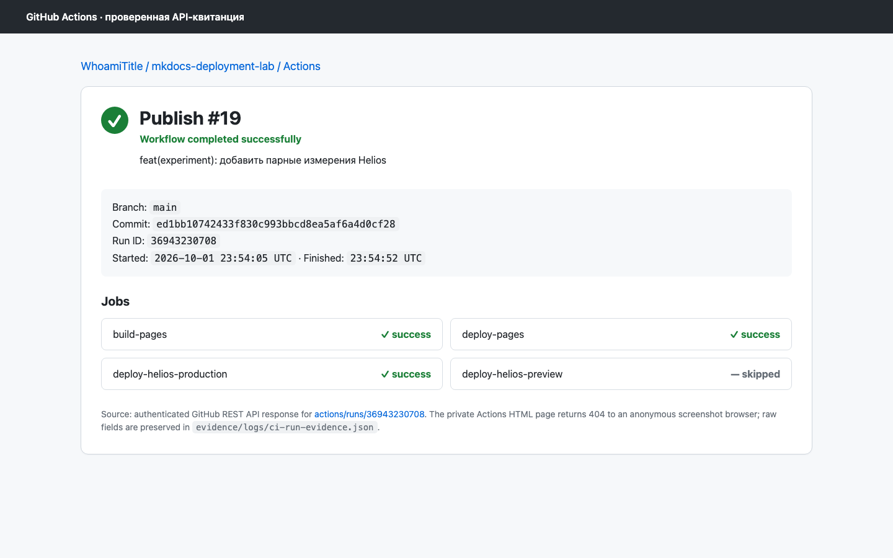
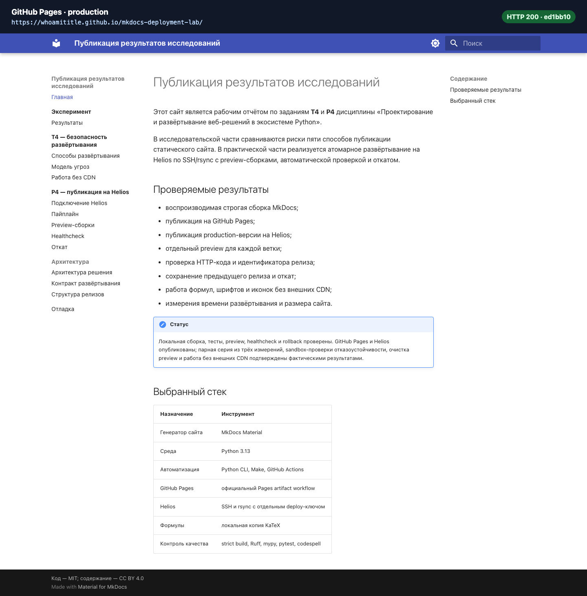
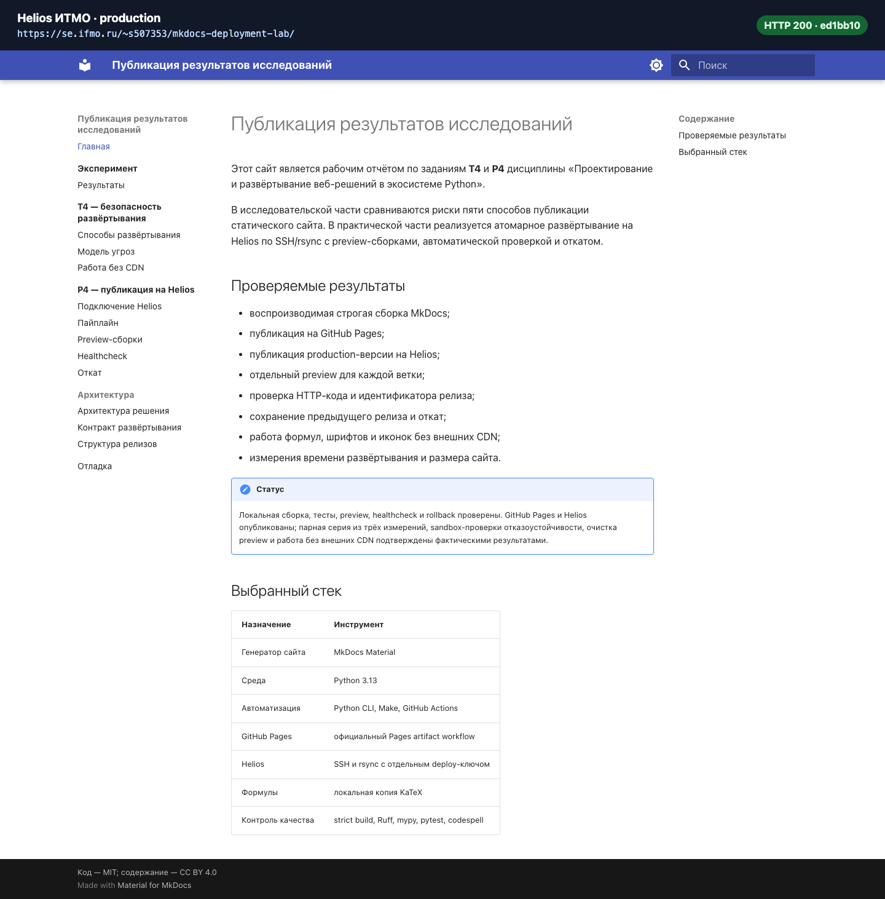

# Подтверждающие материалы

На странице собраны снимки успешного и намеренно проваленного GitHub Actions
run, а также обеих production-площадок. Машиночитаемые исходные поля находятся
в `evidence/logs/ci-run-evidence.json`.

## Запуски GitHub Actions

| Назначение | Run | Ветка | Результат | Безопасность |
|---|---:|---|---|---|
| Итоговая публикация | [36943230708](https://github.com/WhoamiTitle/mkdocs-deployment-lab/actions/runs/36943230708) | `main` | Pages и Helios успешно | production обновлён |
| Демонстрация проверки | [36943920803](https://github.com/WhoamiTitle/mkdocs-deployment-lab/actions/runs/36943920803) | `test/intentional-ci-failure` | ожидаемый отказ `codespell` | Publish run `36943920823` пропущен |

### Успешная публикация

### Намеренно проваленный CI

Во временный commit был добавлен маркер <code>t&#101;h</code>. Этап `codespell` обнаружил его,
вернул ненулевой код, после чего артефакт сайта не загружался. Для этой ветки
preview-deploy был заранее отключён условием workflow. После сохранения лога
ветка была удалена.

!!! info "Происхождение карточек Actions"
    Репозиторий возвращает GitHub 404 при анонимном открытии приватной страницы
    Actions. Поэтому изображения выше — подписанные карточки из
    аутентифицированного GitHub REST API и очищенного лога, а не копии
    приватного HTML-интерфейса. Run ID, SHA, время и заключения jobs сохранены
    без изменения.

## Опубликованные сайты

### GitHub Pages

### Helios ИТМО

Обе страницы на момент проверки отвечали HTTP 200 и публиковали commit
`ed1bb10742433f830c993bbcd8ea5af6a4d0cf28`.
