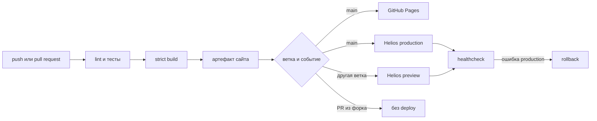

# Пайплайн публикации

Workflow отвечает за событие, permissions, установку Python и получение
секретов. Последовательность прикладных действий реализована Python-командами,
которые одинаково запускаются локально и в CI.

Production job сохраняет отдельные JSON-квитанции сборки, `rsync` и
healthcheck как GitHub Actions artifact. В них нет закрытого ключа или строки
`known_hosts`; они содержат release ID, длительности, размеры и результат
проверки. Это позволяет собирать серию T4 без округления данных из интерфейса.

## Метаданные релиза

В каждый артефакт добавляются:

- идентификатор релиза;
- полный хеш коммита;
- имя ветки;
- дата и время сборки;
- признак незакоммиченных локальных изменений.

Наблюдатель удалённой публикации принимает только релиз с ожидаемым commit SHA
и временем сборки не раньше начала конкретного запуска. Поэтому повторные
workflow одного и того же коммита не могут ошибочно принять предыдущий релиз.
