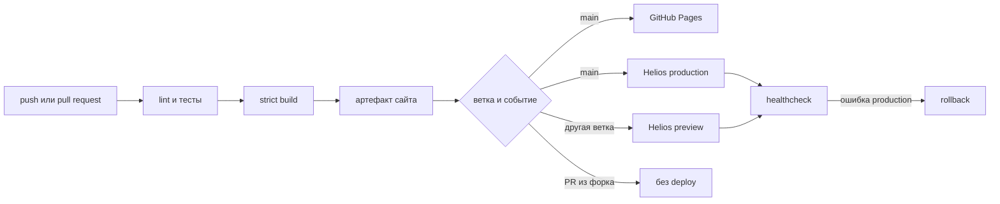

# Пайплайн публикации

Workflow отвечает за событие, permissions, установку Python и получение
секретов. Последовательность прикладных действий реализована Python-командами,
которые одинаково запускаются локально и в CI.

## Метаданные релиза

В каждый артефакт добавляются:

- идентификатор релиза;
- полный хеш коммита;
- имя ветки;
- дата и время сборки;
- признак незакоммиченных локальных изменений.
