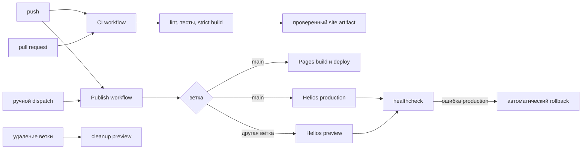

# Пайплайн публикации



Workflow отвечает за событие, permissions, установку Python и получение
секретов. Последовательность прикладных действий реализована Python-командами,
которые одинаково запускаются локально и в CI.

`CI` и `Publish` являются независимыми workflows одного push. Поэтому
публикация не ждёт статус отдельного CI-run, но выполняет собственный strict
build перед upload или `rsync`. Pull request запускает только CI и не получает
deploy-секреты.

Production job сохраняет отдельные JSON-квитанции сборки, `rsync` и
healthcheck как GitHub Actions artifact. В них нет закрытого ключа или строки
`known_hosts`; они содержат release ID, длительности, размеры и результат
проверки. Это позволяет собирать серию T4 без округления данных из интерфейса.

## Метаданные релиза

В каждый артефакт добавляются:

- идентификатор релиза;
- полный хеш коммита;
- имя ветки;
- дата и время сборки;
- признак незакоммиченных локальных изменений.

Наблюдатель удалённой публикации принимает только релиз с ожидаемым commit SHA
и временем сборки не раньше начала конкретного запуска. Поэтому повторные
workflow одного и того же коммита не могут ошибочно принять предыдущий релиз.

## Файлы автоматизации

| Файл | Назначение |
|---|---|
| `.github/workflows/ci.yml` | Ruff, форматирование, codespell, mypy, pytest, strict build и offline-check |
| `.github/workflows/publish.yml` | GitHub Pages, Helios production и branch preview |
| `.github/workflows/rollback.yml` | ручное переключение Helios на предыдущий релиз |
| `.github/workflows/cleanup-preview.yml` | ручная и автоматическая очистка preview после удаления ветки |
| `.github/workflows/helios-resilience.yml` | разрушительные испытания только в sandbox |

Все сторонние Actions закреплены полными commit SHA. Комментарий после SHA
указывает читаемую major-версию, но не участвует в разрешении зависимости.

## События и поведение

| Событие | CI | GitHub Pages | Helios | Результат |
|---|---|---|---|---|
| `push` в `main` | полный quality gate | production | production + healthcheck | две площадки публикуют один SHA |
| `push` в другую ветку | полный quality gate | пропуск | preview по branch slug | production не переключается |
| `pull_request` | полный quality gate | не запускается | не запускается | секреты deploy не требуются |
| ручной `Publish` на `main` | отдельный CI не запускается | production | production + healthcheck | используется для повторов T4 |
| ручной `Roll back Helios` | не запускается | без изменений | активируется `previous` | затем выполняется healthcheck |
| удаление ветки | не запускается | без изменений | удаляется preview этой ветки | ожидаемый HTTP 404 |
| ручной sandbox-тест | не запускается | без изменений | отдельные sandbox-пути | production проверяется на изоляцию |

## CI: качество и проверенный артефакт

Ниже приведён сокращённый текст `ci.yml`; комментарии поясняют назначение
ключевых строк отчёта:

```yaml
on:
  push:          # проверяется каждый отправленный commit
  pull_request:  # код из PR проверяется без deploy-секретов

permissions:
  contents: read # CI не изменяет репозиторий

jobs:
  quality:
    runs-on: ubuntu-latest
    steps:
      - uses: actions/checkout@fbc6f3992d24b796d5a048ff273f7fcc4a7b6c09
      - uses: actions/setup-python@ece7cb06caefa5fff74198d8649806c4678c61a1
        with:
          python-version: "3.13" # версия раннера фиксирована
          cache: pip             # кэш привязан к requirements.txt
      - name: Run quality gates and strict build
        run: make check PYTHON=python
      - name: Upload verified site artifact
        uses: actions/upload-artifact@ea165f8d65b6e75b540449e92b4886f43607fa02
        with:
          path: site/
          retention-days: 7
```

`make check` последовательно запускает линтеры, типизацию, 34 теста, строгую
сборку и проверку отсутствия внешних runtime-ресурсов. При любой ошибке
последующие команды и загрузка артефакта не выполняются.

## Маршрутизация production

Два production job получают один commit, но собирают сайт отдельно, поскольку
им нужны разные `SITE_URL`:

```yaml
jobs:
  build-pages:
    if: github.ref == 'refs/heads/main' # Pages только из main
    permissions:
      contents: read
      pages: read

  deploy-pages:
    needs: build-pages                 # deploy только после Pages build
    permissions:
      pages: write
      id-token: write

  deploy-helios-production:
    if: github.ref == 'refs/heads/main' && vars.HELIOS_ENABLED == 'true'
    environment: helios-production     # отдельная граница секретов и настроек
```

Pages использует официальный artifact deployment. Helios получает отдельный
ключ только внутри production environment.

## Helios: доставка, проверка и откат

Секреты сначала записываются во временные файлы с режимом `0600`. В репозитории
и artifact они не сохраняются:

```yaml
- name: Prepare protected SSH files
  env:
    HELIOS_SSH_KEY: ${{ secrets.HELIOS_SSH_KEY }}
    HELIOS_KNOWN_HOSTS: ${{ secrets.HELIOS_KNOWN_HOSTS }}
  run: |
    install -d -m 700 .secrets
    install -m 600 /dev/null .secrets/helios_key
    install -m 600 /dev/null .secrets/known_hosts
    printf '%s\n' "$HELIOS_SSH_KEY" > .secrets/helios_key
    printf '%s\n' "$HELIOS_KNOWN_HOSTS" > .secrets/known_hosts

- name: Deploy production release
  id: deploy
  run: python -m publication_pipeline deploy-ssh --site-dir site

- name: Verify production release
  run: >-
    python -m publication_pipeline healthcheck
    --url "$HELIOS_BASE_URL"
    --release-file site/release.json
    --attempts 5
    --delay-seconds 5

- name: Roll back after a failed production healthcheck
  if: failure() && steps.deploy.outcome == 'success'
  run: python -m publication_pipeline rollback-ssh
```

Условие rollback различает ошибку загрузки и ошибку после переключения. Если
`deploy-ssh` не завершился, активная ссылка ещё не менялась. Если deploy прошёл,
но HTTP-проверка упала, workflow возвращает `previous`.

## Preview и очистка

```yaml
deploy-helios-preview:
  if: github.ref != 'refs/heads/main' && vars.HELIOS_ENABLED == 'true'
  environment: helios-preview

# В cleanup-preview.yml:
on:
  workflow_dispatch: # ручная очистка с точным именем ветки
  delete:            # автоматическая очистка после удаления ветки
```

Имя ветки преобразуется в slug с коротким хешем. Cleanup требует совпадения
`branch` и `confirm-branch`, удаляет только каталог вычисленного slug и
подтверждает недоступность URL кодом HTTP 404.

## Артефакты

| Артефакт | Источник | Срок | Содержимое |
|---|---|---:|---|
| `site-build-<sha>` | CI | 7 дней | проверенный статический сайт |
| Pages artifact | `build-pages` | управляется Pages | сайт для официального deployment |
| `pages-measurement-<run-id>` | `build-pages` | 30 дней | время и размер сборки |
| `helios-measurement-<run-id>` | Helios production | 30 дней | build, `rsync`, healthcheck |
| `helios-resilience-<run-id>` | sandbox workflow | 30 дней | результаты отказоустойчивости |
| `preview-cleanup-<run-id>` | cleanup workflow | 30 дней | branch slug и число удалённых релизов |
